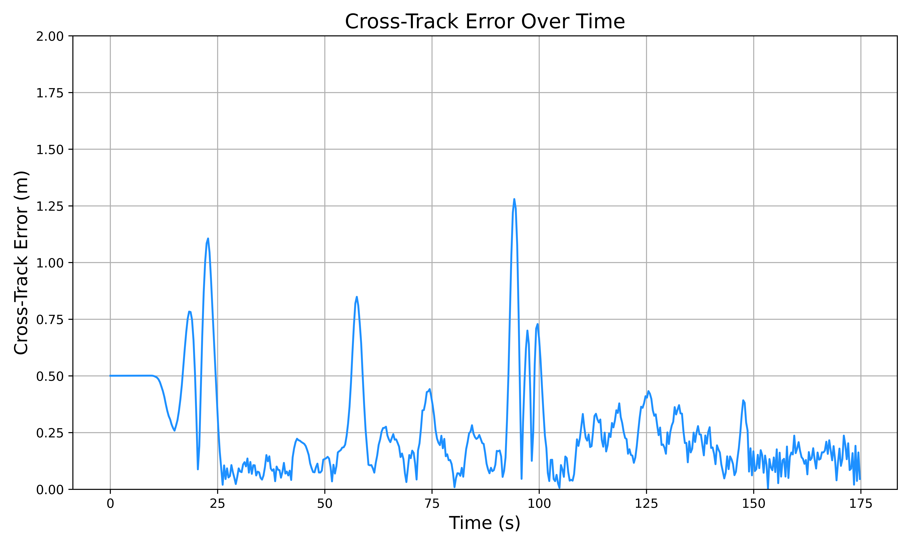

<!-- Improved compatibility of back to top link: See: https://github.com/othneildrew/Best-README-Template/pull/73 -->
<a id="readme-top"></a>
<br />
<div align="center">
<h3 align="center">MPC Controller for Polaris GEM e2</h3>

<div align="center">
<a href="images"></a>
</div>

<p align="center">
This project implements a Model Predictive Control (MPC) framework for a Polaris GEM e2 vehicle within the Gazebo simulation environment. The MPC controller is based on a dynamic vehicle model, and accounts for the vehicle's kinematic and dynamic constraints to ensure optimal path following and obstacle avoidance.
<br />
</p>
</div>

<!-- TABLE OF CONTENTS -->
<details>
<summary>Table of Contents</summary>
<ol>
<li>
<a href="#requirements">Requirements</a>
</li>
<li>
<a href="#installation-instructions">Installation Instructions</a>
</li>
<li><a href="#usage">Usage</a></li>
<li>
<a href="#implementation-details">Implementation Details</a>
    <ul>
        <li><a href="#vehicle-model">Vehicle Model</a></li>
        <li><a href="#vehicle-parameters">Vehicle Parameters</a></li>
        <li><a href="#state-and-control-limits">State and Control Limits</a></li>
        <li><a href="#obstacle-modeling">Obstacle Modeling</a></li>
        <li><a href="#road-modeling">Road Modeling</a></li>
        <li><a href="#overall-optimization-problem">Overall Optimization Problem</a></li>
    </ul>
</li>
<li>
<a href="#description-of-publishers-and-subscribers">Description of Publishers and Subscribers</a>
    <ul>
        <li><a href="#publishers">Publishers</a></li>
        <li><a href="#subscribers">Subscribers</a></li>
    </ul>
</li>
<li><a href="#docker-image">Docker Image</a></li>
<li><a href="#general-considerations-and-comments">General Considerations and Comments</a></li>
<li><a href="#results">Results</a></li>
<li><a href="#license">License</a></li>
<li><a href="#references">References</a></li>
</ol>
</details>


## Requirements

The project has been developed and tested on [Ubuntu 20.04 LTS](https://releases.ubuntu.com/focal/) with ROS Noetic (Gazebo 11) and [CasADi](https://web.casadi.org/) 3.6.6. 

1. Install ROS Noetic and Gazebo 11 (Desktop-Full Install): [https://wiki.ros.org/noetic/Installation/Ubuntu](https://wiki.ros.org/noetic/Installation/Ubuntu)
2. Install required ROS packages
```bash
sudo apt install ros-noetic-ackermann-msgs ros-noetic-geometry2 \
ros-noetic-hector-gazebo ros-noetic-hector-models ros-noetic-jsk-rviz-plugins \
ros-noetic-ros-control ros-noetic-ros-controllers ros-noetic-velodyne-simulator
```
3. Install required Python packages
```bash
python3 -m pip install numpy==1.24.0 pandas==1.2.4 casadi==3.6.6
```
<!-- GETTING STARTED -->
## Installation Instructions

1. Clone the repo
```bash
git clone https://github.com/michaelmkhayyat/POLARISGEME2_MPC.git
```
2. Compile the workspace
```bash
source /opt/ros/noetic/setup.bash
cd ~/POLARISGEME2_MPC
catkin_make
source devel/setup.bash
```

## Usage

1. Run Gazebo/rviz in workspace directory (with or without obstacles)
```bash
source devel/setup.bash
roslaunch gem_gazebo_rviz_mpc.launch spawn_obstacles:=true
```
2. Run the MPC Controller
```bash
source devel/setup.bash
roslaunch gem_mpc mpc_controller.launch
``` 

## Implementation Details

### Vehicle Model
<div align="center">
<a href="images"></a>
</div>

The following are the parameters of the vehicle:
<div align="center">

| Symbol | Definition |
| ------------- |:-------------:|
| $l_f$ | distance between front axle and CoG|
| $l_r$ | distance between rear axle and CoG|
| $l_{wb}$ |wheelbase|
| $m$ | mass of the vehicle|
| $I_z$ | yaw moment of inertia of the vehicle|
| $p_x$ | $x$-position in global reference frame|
| $p_y$ | $y$-position in global reference frame|
| $v_x$ | longitudinal velocity in local reference frame|
| $v_y$ | lateral velocity in local reference frame|
| $\delta$ | steering angle at front wheels|
| $\psi$ | yaw angle of the vehicle|
| $\dot{\psi}$ | yaw rate of the vehicle|
| $F_{yf}$ | lateral force at front wheels|
| $F_{yr}$ | lateral force at rear wheels |
| $\beta$ | side slip angle at CoG|
| $\alpha_f$ | slip angle at front tire|
| $\alpha_r$ | slip angle at rear tire|

</div>

The chosen vehicle model is a dynamic car-like model, described by the following set of ODEs:

$$
f_{dyn} = \begin{array}{l}
\dot{p}_x=v_x \cos{\psi} - v_y \sin{\psi} \\
\dot{p}_y=v_x \sin{\psi} + v_y \cos{\psi}\\
\dot{\delta}=u_1 \\
\dot{v}_x = \dot{\psi} v_y + u_2\\
\dot{v}_y = -\dot{\psi} v_x + \dfrac{2}{m}(F_f\cos{\delta} + F_r)\\
\dot{\psi}=\dfrac{v_x}{l_f + l_r} \tan{\delta}\\
\ddot{\psi} = \dfrac{2}{I_z}(l_f F_f - l_r F_r)
\end{array}
$$ 


where the control commands are the steering rate at the front wheels and the acceleration:

$$u = [\dot{\delta}, a_x]$$

Note that the lateral forces are modelled as follows:

$$
\begin{array}{l}
F_{f}=C_{Sf} \alpha_f\\
F_{r}=C_{Sr} \alpha_r
\end{array}
$$

where $C_{Sf}$ and $C_{Sr}$ are the cornering stiffness at the front and rear tires, respectively, and:

$$
\begin{array}{l}
\alpha_f = \delta - \arctan{\dfrac{\dot{\psi}l_f +v_y}{v_x}} \approx \delta - \beta - \dfrac{l_f\dot{\psi}}{v_x}\\
\alpha_r = \arctan{\dfrac{\dot{\psi}l_r +v_y}{v_x}} \approx \beta + \dfrac{l_r \dot{\psi}}{v_x} \\
\beta = \arctan{\dfrac{v_y}{v_x}}
\end{array}
$$

The exact and approximate implemenations of the equations above is presented in our code. The lateral forces could be modeled more accurately using the Pacejka tire model, i.e:

$$
F_{y} = D_f \sin \left( C_f \cdot \arctan \left( B_f \alpha_f \right) \right)
$$

However, at low to moderate speeds the linear range of the curve is utilized. Hence, for computational efficiency we adopt the formulation we presented earlier -- Note that in racing or high speed applications we resort to combined slip models. However, this is out of the scope of the project.

It is noteworthy that the model does not work properly at low speeds, due to the definition of $\beta$ (Unlike the kinematic bicycle model, $\beta$ here is defined dynamically). There are generally two approaches to remedy this problem:

1. Creating a switch where $\beta$ is defined kinematically at low speeds (generally $v \leq 0.1 ms^{-1}$) and switching to a dynamic definition after.
2. Adding a small value at the denominator of $\beta$ to avoid division by zero.

In our work, we adopted the latter approach, as it was previously tested in practice in works such as [3, 4].


### Vehicle Parameters

The parameters of the vehicle were obtained by inspecting the urdf file of the robot. More specifically, the following command is executed:

```bash
rosrun xacro xacro gem.urdf.xacro -o expanded_gem.urdf robotname:=gem_robot
```

and the contents of the folder were inspected to find the net mass and the yaw moment of inertia, which were found to be $734$ kg and $465$ $\text{kg} \text{m}^2$, respectively.

The geometric parameters of the vehicle $l_f$, $l_r$ are both $0.875$ m. 

Moreover, the limits on the steering angle are $[-0.61, 0.61]$ and those on the velocity are $[0,20]$ .

### State and Control Limits


### Obstacle Modeling

In this project, obstacles are modeled as cylinders to simplify geometric representation, and collision avoidance is implemented using soft constraints. Note that both a soft and hard formulation of collision avoidance were tested.

We adopt the **relaxed** barrier function approach from [5]. The penalty function for collision avoidance is structured as a log-barrier function within the interior of the feasible space. At a specified distance from the constraint boundary, the log-barrier transitions into a quadratic penalty. This approach prevents the *blow-up* of typical log-barrier approaches. Thus, collision avoidance is formulated as follows:

$$
B(h) =
\begin{cases} - \mu \ln(h), & h \geq \delta, \\
\frac{\mu}{2}\Big(\big(\frac{h - 2\delta}{\delta}\big)^2 - 1\Big)- \mu \ln(\delta), & h < \delta. \end{cases}
$$

where $h$ is the Eucledean distance between the vehicle and obstacle, defined as follows:

$$ h(p_x, p_y, x_{obs}, y_{obs}) = \sqrt{(p_x - x_{obs})^2 + (p_y - y_{obs})^2} - r_{ego} - r_{obs}$$

where $r_{ego}$ and $r_{obs}$ are the radii of the circles that model that ego and obstacle vehicle, respectively.
In CasADi, the constraint above is implemented using an if-else function.


### Road Modeling

To formulate the optimization problem for following a reference path, it is essential to define a function that quantifies the vehicle's deviation from the desired trajectory.

In this project, we resort the the method described in [2, Section III.A.2]. We summarize it in the following by adopting the notation and figures from [2].

The reference path is parametrized by its arc length $\theta \in [0, L]$ using b-splines, where $L$ is the total length of the path. Using this parametrization, we are able to obtain any point $X^{ref} (\theta), Y^{ref}(\theta)$ by evaluating the b-spline for $\theta$. The angle of the tangent to the path at the reference point with respect to the global $x$-axis is also readily available through CasADi's automatic differentiation:

$$\phi(c) = \arctan{\frac{\partial Y^{ref}(c)}{\partial X^{ref}(c)}}$$.

Now, we are able to define some error measures that define the deviation of the car's current position $X,Y$ from the desired reference point $X^{ref} (\theta), Y^{ref}(\theta)$. We define $P: R^2 \rightarrow [0,L]$ as the projection operator on the reference trajectory defined by the following:

$$P(X,Y) = \theta_P = \text{argmin}_\theta (X-X^{ref} (\theta))^2 +  (Y-Y^{ref} (\theta))^2$$. 

<div align="center">
<a href="images"></a>
</div>

Then, the orthogonal distance of the car from the reference path is then given by the contouring error:

$$
e^c(X, Y, \theta_P) = \sin(\phi(\theta_P))  (X - X_{\text{ref}}(\theta_P)) - \cos(\phi(\theta_P)) (Y - Y_{\text{ref}}(\theta_P))
$$

The equation above represents the exact contouring error. While the theoretical result is interesting, it is impractical for use in path-tracking applications as yields a nested optimization framework. Thus, we resort to an approximation of $\theta_P$, denoted as $theta_A$, as depicted in the figure below:

<div align="center">
<a href="images"></a>
</div>


As demonstrated in [2], for this approximation to be meaningful, we introduce the lag error, which measures the error between $\theta_P$ and $\theta_A$, as follows:

$$
e^l(X,Y,\theta_A) = |\theta_A - \theta_P|
$$

So, now we are introduce the approximate contouring error $\hat{e}^c$, and the approximate lag error $\hat{e}^l$, as follows:

$$
\begin{array}{l}
e^c \approx \hat{e}^c(X, Y, \theta_A) = \sin(\phi(\theta_A))  (X - X_{\text{ref}}(\theta_A)) - \cos(\phi(\theta_A)) (Y - Y_{\text{ref}}(\theta_A)) \\
e^l \approx \hat{e}^L(X, Y, \theta_A) = - \cos(\phi(\theta_A))  (X - X_{\text{ref}}(\theta_A)) - \sin(\phi(\theta_A)) (Y - Y_{\text{ref}}(\theta_A))
\end{array}
$$

### Overall Optimization Problem

Thus, the goal of the optimization problem is to minimize the contouring and lag errors while respecting the obstacle avoidance, as well as the system operational limits. The following optimization problem is formulated:

$$
\begin{aligned}
\text{min} \quad & \sum_{k=1}^{N}|| \hat{e}^c(X_k, Y_k, \theta_{A,k}) ||^2_{q_c} + || \hat{e}^l(X_k, Y_k, \theta_{A,k}) ||^2_{q_l} + ||B(h(X_k, Y_k, x_{obs,k}, y_{obs,k}))||^2_{q_{obs}} - \gamma\nu_k T_s + ||x_k||^2_{R_x}  + || \Delta u_k||^2_{R_u} + || \Delta \nu_k||^2_{R_\nu}\\
&\text{s.t} \\
&\begin{array}{l}
& x_0 = x_{\text{initial}}&\\
& x_{k+1} = f_{dyn}(x_k, u_k) & \forall k=0,...,N-1\\
& \theta_0 = \theta_{\text{initial}} &\\
& \theta_{A,k+1}= \theta_{A,k} + \nu_k T_s & \forall k = 0,\dots,N-1\\
& 0 \leq \theta_k \leq L & \forall k = 1, \dots, N\\
& 0 \leq \nu_k \leq \nu_{\max}& \forall k = 0, \dots, N\\
& x_{\min} \leq x_k \leq x_{\max}& \forall k = 1, \dots, N\\
& u_{\min} \leq u_k \leq u_{\max}& \forall k = 0, \dots, N-1\\
& -\frac{1}{2} w_{lane} + r_{ego} \leq \hat{e}^c(X_k, Y_k, \theta_{A,k}) \leq \frac{1}{2} w_{lane} -r_{ego}& \forall k=0, \dots, N 
\end{array}
\end{aligned}
$$

where $\Delta u_k = u_k - u_{k-1}$ and $\Delta \nu_k = \nu_k - \nu_{k-1}$. Note that $\nu_k$ is the projected velocity on the path, and indicates the rate of progress along the arc-length parametrized path.

Explanation of terms in cost function:
1. $|| \hat{e}^c(X_k, Y_k, \theta_{A,k}) ||^2_{q_c}$: Penalizes contour errors (encourages staying close to centerline).
2. $|| \hat{e}^l(X_k, Y_k, \theta_{A,k}) ||^2_{q_l}$: Penalizes lag errors (encourages progress along the path).
3. $||B(h(X_k, Y_k, x_{obs,k}, y_{obs,k}))||^2_{q_{obs}}$: Penalizes proximity to obstacles (as described in the previous section).
4. $- \gamma\nu_k T_s$: Rewards progress along the path.
5. $||x_k||^2_{R_x}$: Penalizes the increase in some states. More specifically, we penalize high yaw rate ($\dot{\psi}$) and high lateral velocity ($v_y$) as to maintain the stability of the vehicle. 
6. $|| \Delta u_k||^2_{R_u}$: Penalizes fluctations in the control (encourges smooth commanded control).
7. $|| \Delta \nu_k||^2_{R_\nu}$: Penalizes fluctations in progress (encourages smooth progress along the path).
8. $x_0 = x_{\text{initial}}$: Initial state of the OCP.
9. $x_{k+1} = f_{dyn}(x_k, u_k)$: A discretization (RK4/Euler) of the ODE that governs the dynamics of the vehicle model.
10. $\theta_0 = \theta_{\text{initial}}$: Initial progress along the path for the OCP.
11. $0 \leq \theta_k \leq L$: Constrains the parametrization parameter to be between 0 and the length of the path.
12. $0 \leq \nu_k \leq \nu_{\max}$: Constrains the projected velocity of the vehicle on the path.
13. $x_{\min} \leq x_k \leq x_{\max}$: Constraints on the states such as the steering angle, yaw rate, lateral and longitudinal velocities.
14. $u_{\min} \leq x_k \leq u_{\max}$: Constraints on the controls, namely the commanded acceleration and the steering rate.
15. $-\frac{1}{2} w_{lane} + r_{ego} \leq \hat{e}^c(X_k, Y_k, \theta_{A,k}) \leq \frac{1}{2} w_{lane} -r_{ego}$: Constraints on road departure.

The optimal control problem is solved in receding horizon fashion, such that at every iteration it solves the above OCP, sends the first control command to the low-level controller, and utilizes the solution as an initial guess for the next one (this helps speed up the solver, as it is a local solver).

## Description of Publishers and Subscribers

To facilitate the implementation and testing, we have utilized the following publishers and subscribers:

### Publishers

| Topic | Type | Use |
| ------------- |:-------------:|:-------------:|
| '/mpc/path/rviz'| nav_msgs/Path |   Visualization of central path  |
| /mpc/path_boundary_l/rviz |  nav_msgs/Path |   Visualization of left boundary |
| /mpc/path_boundary_r/rviz |  nav_msgs/Path |   Visualization of right boundary |
|'/mpc/obstacles/cubes/rviz' | visualization_msgs/MarkerArray | Visualization of obstacles in rviz|
| '/mpc/planned_path/rviz'        | visualization_msgs/MarkerArray | Visualization of planned path in rviz|
| '/gem/ackermann_cmd'        | ackermann_msgs/AckermannDrive | Sending high-level commands to low-level controller|

### Subscribers


| Topic | Type | Use |
| ------------- |:-------------:|:-------------:|
| '/mpc/obstacles_info'| vision_msgs/Detection3DArray |   Objects bounding box|
| '/mpc/path_info'| nav_msgs/Path |  Obtaining the central path waypoints|
| '/gem/base_footprint/odom'| nav_msgs/Odometry |   Obtaining the state of robot |
| '/gem/right_steering_ctrlr/state'| control_msgs/JointControllerState |   Obtaining the right wheel steering angle |
| '/gem/left_steering_ctrlr/state'| control_msgs/JointControllerState |   Obtaining the left wheel steering angle |

## Docker Image

To build the docker image:

```bash
sudo docker build -t polaris_mpc_image .
```

To launch the docker image:

```bash
sudo docker run -it \
--net=host \
--ipc=host \
--privileged \
--env="DISPLAY" \
--env="QT_X11_NO_MITSHM=1" \
--volume="/tmp/.X11-unix:/tmp/.X11-unix:rw" \
--volume="${XAUTHORITY}:/root/.Xauthority" \
polaris_mpc_image
```

To start Gazebo (change flag of spawn_obstacles):

```bash
roslaunch gem_gazebo gem_gazebo_rviz_mpc.launch spawn_obstacles:=true
```

To start the MPC simulation:

```bash
roslaunch gem_mpc mpc_controller.launch
``` 

## General Considerations and Comments

Some considerations regarding the implementation:

1. The measurements from the odometry (position, and global velocity coordinates) correspond to the rear-axle of the vehicle. So, the necessary transformation were performed to move from the reference frame of the odometry to the reference frame at the CoG (which our modeling and control are based around). All these transformations are present in the odom_callback method function.
   
2. We have commented out parts related to the Front Sonar and Camera from gem.urdf.xacro, as they were causing the following error sometimes: Segmentation fault (core dumped)

3. It is advisable to run Gazebo in a *headless* manner to preserve computational power.
   
4. Note that the path in "waypoints.csv" *does not exactly match* the centerline of the track. However, we chose to use it to align with the other controllers presented in the original repository: https://gitlab.engr.illinois.edu/gemillins/POLARIS_GEM_e2/. It is possible to obtain the exact centerline of the track by examining 'simple_track_green.world' and its corresponding files.

## Results

The following is the cross-track error during path tracking (without obstacles):

<div align="center">
<a href="images/results/no_obstacles/"></a>
</div>

The following is the cross-track error during path tracking (with obstacles):

<div align="center">
<a href="images/results/with_obstacles/"></a>
</div>

## License

The developed MPC controller is distributed under the MIT License. See `LICENSE.txt` for more information.

## References

* [1] Choi, Young-Min, and Jahng-Hyon Park. "Game-based lateral and longitudinal coupling control for autonomous vehicle trajectory tracking." IEEE Access 10 (2021): 31723-31731.
* [2] Liniger, Alexander, Alexander Domahidi, and Manfred Morari. "Optimization‐based autonomous racing of 1: 43 scale RC cars." Optimal Control Applications and Methods 36, no. 5 (2015): 628-647.
* [3] Arrigoni, Stefano, Matteo Pirovano, Simone Mentasti, Michael Khayyat, Francesco Braghin, Federico Cheli, and Matteo Matteucci. "Experimental Implementation of a Trajectory Planner for Autonomous Driving." In 2022 AEIT International Annual Conference (AEIT), pp. 1-6. IEEE, 2022.
* [4] Micheli, Francesco, Mattia Bersani, Stefano Arrigoni, Francesco Braghin, and Federico Cheli. "NMPC trajectory planner for urban autonomous driving." Vehicle system dynamics 61, no. 5 (2023): 1387-1409.
* [5] Feller, Christian, and Christian Ebenbauer. "A stabilizing iteration scheme for model predictive control based on relaxed barrier functions." Automatica 80 (2017): 328-339.

<p align="right">(<a href="#readme-top">back to top</a>)</p>
